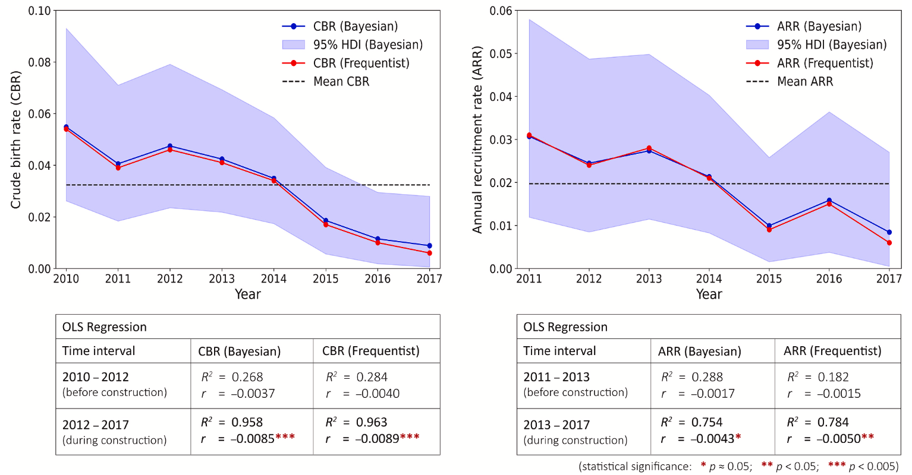

# Reproductive dynamics of an inshore delphinid reflect demographic consequences of large-scale coastal constructions

Chan, S.C.Y., Ho, Y.-W., & Karczmarski, L. (2024). Reproductive dynamics of an inshore delphinid reflect demographic consequences of large-scale coastal constructions. _Biological Conservation_, 297, 110690.

Crude birth rate (CBR) and annual recruitment rate (ARR) of Indo-Pacific humpback dolphins estimated using frequentist (red) and Bayesian (blue) statistical techniques. OLS regression models indicate that both CBR and ARR declined significantly following the onset of construction activities.

# Abstract

In fast-developing regions, rapid coastal urbanization has led to considerable transformation of both landscapes and seascapes, with various adverse implications for species dependent on inshore habitats. As reliable estimates of vital demographic rates reflect the population-level responses to stressors, rigorous quantification of these parameters is central to assessing the consequences of human-induced environmental change. As a case-in-point, we quantified the reproductive parameters and calf survivorship of an obligatory inshore delphinid, the Indo-Pacific humpback dolphin (Sousa chinensis), in the anthropogenic seascape of Hong Kong prior and during two consecutive large-scale coastal infrastructure projects. Our 8-year photo-ID mark-recapture dataset was examined with both frequentist and Bayesian techniques. The reproductive output of female dolphins worsened significantly following the onset of construction activities, eventually declining alarmingly close to zero. Annual recruitment rate followed a similar trajectory. Concurrently, calf survival rates (pooled across the study period) were low, with <60% of newborns surviving the first 3-month and <46% surviving their first year of life. Both mean crude birth rate (~0.03) and annual recruitment rate (~0.02) were among the lowest reported for coastal delphinids to date. Cumulatively, all of this slows population recruitment and increases population susceptibility to stochastic events. We conclude that natural factors alone are not likely to cause such critically low demographic rates, underscoring the vulnerability of obligatory inshore species to growing anthropogenic pressure and habitat loss in fast-changing coastal seas. We emphasize the need for proactive (instead of reactive) conservation based on reliable sentinel model system and wise use of the precautionary principle.

## Software implementation

All source code used for analysis and figure generation in this study is available in `analysis.ipynb`. The notebook includes scripts for both frequentist and Bayesian statistical analyses, providing a comprehensive view of the methods applied to assess the impact of coastal constructions on dolphin demographics.

## Data Availability

The analytical code supporting our findings is included in this repository. For additional information or data requests, please contact the Cetacea Research Institute:

- [Stephen C.Y. Chan](mailto:scychan@cetacea-institute.org)
- [Yuen-Wa Ho](mailto:hoyuenwa@cetacea-institute.org)
- [Leszek Karczmarski](mailto:leszek@cetacea-institute.org)

[Cetacea Research Institute](https://www.hku-cetacean-ecology.net/cri)
