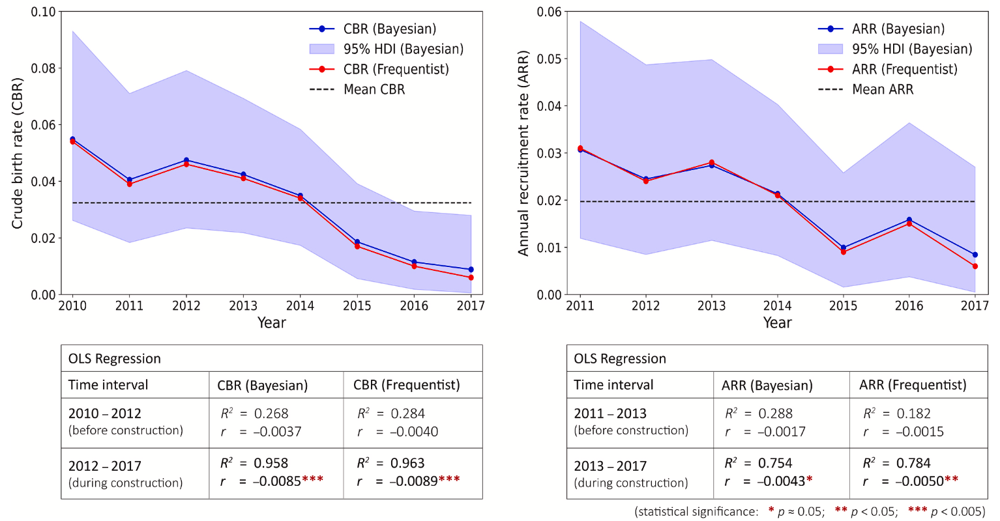

# Reproductive dynamics of an inshore delphinid reflect demographic consequences of large-scale coastal constructions

Chan, S. C. Y., Ho, Y.-W., & Karczmarski, L. (2024). Reproductive dynamics of an inshore delphinid reflect demographic consequences of large-scale coastal constructions. $Biological$ $Conservation$, 297, 110690.

- *All authors contributed equally to this work.*

**Figure. (A) Crude birth rate (CBR) and (B) annual recruitment rate (ARR) of Indo-Pacific humpback dolphins estimated using frequentist (red) and Bayesian (blue)
statistical techniques. Ordinary Least Squares (OLS) regression models indicate that both CBR and ARR declined significantly following the onset of construction
activities. Note that the time interval of ARR (the ratio of births surviving to the age of 1 y.o.) lags that of CBR by 1 year, and ARR is not available for the first year
(year 2010). For both CBR and ARR, the mean values by frequentist and Bayesian methods are virtually identical (see the numeric values in Appendix Table A2);
therefore, only the Bayesian mean (horizontal black dashed line) is displayed to avoid overlapping lines. 95% HDI: 95% highest density interval; R2: correlation
coefficient; r: annual rate of change.**

# Abstract
In fast-developing regions, rapid coastal urbanization has led to considerable transformation of both landscapes and seascapes, with various adverse implications for species dependent on inshore habitats. As reliable estimates of vital demographic rates reflect the population-level responses to stressors, rigorous quantification of these parameters is central to assessing the consequences of human-induced environmental change. As a case-in-point, we quantified the reproductive parameters and calf survivorship of an obligatory inshore delphinid, the Indo- Pacific humpback dolphin (Sousa chinensis), in the anthropogenic seascape of Hong Kong prior and during two consecutive large-scale coastal infrastructure projects. Our 8-year photo-ID mark-recapture dataset was examined with both frequentist and Bayesian techniques. The reproductive output of female dolphins worsened significantly following the onset of construction activities, eventually declining alarmingly close to zero. Annual recruitment rate followed a similar trajectory. Concurrently, calf survival rates (pooled across the study period) were low, with <60% of newborns surviving the first 3-month and <46% surviving their first year of life. Both mean crude birth rate (~0.03) and annual recruitment rate (~0.02) were among the lowest reported for coastal delphinids to date. Cumulatively, all of this slows population recruitment and increases population susceptibility to stochastic events. We conclude that natural factors alone are not likely to cause such critically low de- mographic rates, underscoring the vulnerability of obligatory inshore species to growing anthropogenic pressure and habitat loss in fast-changing coastal seas. We emphasize the need for proactive (instead of reactive) con- servation based on reliable sentinel model system and wise use of the precautionary principle.

## Software implementation
All source code used to generate the results and figures in the paper are in the `analysis.ipynb`.

## Data Availability
The data supporting the findings of this study are provided in the `analysis.ipynb`. For interim data requests or metadata inquiries, please contact Yuen-Wa Ho [hoyuenwa@cetacea-institute.org].

## Authors
For any queries or further information, please reach out to [Cetacea Research Institute](https://www.hku-cetacean-ecology.net/cri):
- [Stephen C.Y. Chan ](mailto:scychan@cetacea-institute.org)
- [Yuen-Wa Ho](mailto:hoyuenwa@cetacea-institute.org)
- [Leszek Karczmarski](mailto:leszek@cetacea-institute.org)